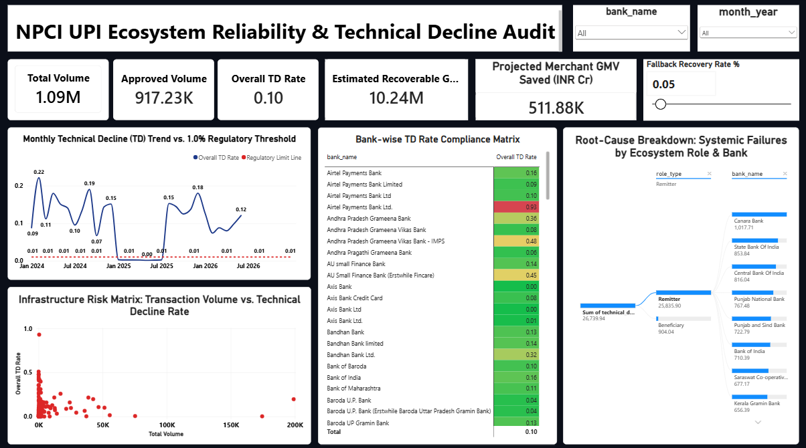

# NPCI UPI Ecosystem Reliability & Technical Decline Audit
> **Auditing Bank Core-Banking System (CBS) Downtime & Simulating Smart Rerouting**

---

## 📌 Project Overview & Business Context

India’s Unified Payments Interface (UPI) processes billions of transactions monthly across a strict **4-tier ecosystem**:
* **The App / TPAP:** Consumer interfaces like Google Pay, PhonePe, or Paytm.
* **The Remitter Bank:** The sender’s bank (e.g., SBI) responsible for debiting the account.
* **The NPCI Central Switch:** The central clearing and routing network.
* **The Beneficiary Bank:** The receiver’s bank (e.g., HDFC) responsible for crediting the account.

NPCI strictly categorizes transaction failures into two buckets:
* **Business Declines (BD):** Customer-induced errors like wrong UPI PIN or insufficient funds.
* **Technical Declines (TD):** Systemic infrastructure failures such as Core Banking System timeouts or network drops.

NPCI mandates that banks maintain a **Technical Decline (TD) rate strictly below 1.0%**. 

This project delivers an end-to-end analytical audit of ecosystem downtime, isolating chronic threshold violators, running SQL diagnostics, and consolidating everything into an interactive **Power BI Master Dashboard** equipped with a smart-rerouting simulator to prevent merchant revenue loss.

---

### The Core Problem & Goal
* **Regulatory Breach:** NPCI mandates that banks maintain a Technical Decline (TD) rate strictly below 1.0%. Major public and private banks routinely breach this threshold during peak traffic hours and high-volume salary cycles.
* **Commercial Risk:** For merchant payment aggregators (Razorpay, Cashfree, Pine Labs), high TD rates create checkout drop-offs, user churn, and silent revenue loss.
* **The Solution:** An end-to-end analytical pipeline and Power BI Master Dashboard designed to audit chronic threshold violators, isolate CBS downtime anomalies, and simulate smart gateway rerouting to recover lost capital.

---

## 📊 Key Metrics at a Glance

| Metric / Dimension | Value / Benchmark | Business Focus |
| :--- | :--- | :--- |
| **Analyzed Data Scope** | 60+ Monthly Reports | Multi-year NPCI Remitter & Beneficiary performance |
| **Regulatory Limit** | $< 1.0\%$ Technical Decline (TD) | NPCI mandatory compliance threshold |
| **Public Sector Burden** | $> 68\%$ of Ecosystem TDs | Legacy CBS bottlenecks (spikes on 1st–5th of month) |
| **Recovery Potential** | Up to $60\%$ of Abandoned Orders | Dynamic gateway fallback routing savings |

---

## 🛠️ Tech Stack & Architecture

* **Data Extraction & Transformation:** Python (`Pandas`, `NumPy`, `RegEx`) — automating the end-to-end ingestion, cleaning, and standardization of 60+ raw monthly reports into a unified schema.
* **Database & Advanced Analytics:** SQL (`MySQL`) — engineering relational database schemas, executing window functions (`LAG`), CTEs, and conditional aggregations for historical compliance audits.
* **Statistical Diagnostics:** Python (`scipy.stats`) — performing Pearson correlation testing and Z-Score anomaly detection ($z > 2.5$) to isolate variance.
* **Data Visualization & Simulation:** Power BI — an executive-grade Master Dashboard featuring advanced DAX modeling, conditional matrix formatting, and a dynamic What-If gateway fallback simulation.

---

## ⚙️ Phase 1: Data Pipeline Engineering (`data_pipeline.ipynb`)

Raw reports sourced directly from the NPCI portal contained inconsistent formats (varying decimal fractions versus percentages) and irregular headers. A custom automated Python script was deployed to:
* Dynamically parse and segregate remitter and beneficiary performance reports.
* Extract `month_year` attributes programmatically via RegEx pattern matching.
* Standardize columns, manage strict data type conversions, and output a clean **9-column master dataset** (`npci_upi_clean_data.csv`):
  * `month_year` (YYYY-MM)
  * `bank_name`
  * `role_type` (Remitter / Beneficiary)
  * `total_volume_mn`
  * `approved_volume_mn`
  * `approved_pct`
  * `technical_decline_pct`
  * `business_decline_pct`
  * `total_decline_pct`

---

## 🔍 Phase 2: SQL Diagnostic Analysis & Compliance Audit

Loaded into a relational database, robust SQL queries were executed to audit structural banking failures:
* **Chronic Threshold Violators:** Identified financial institutions repeatedly breaching the regulatory 1.0% Technical Decline threshold across multiple months, quantifying total cumulative lost transaction volumes.
* **MoM Degradation (`LAG` Window Function):** Tracked sudden operational infrastructure failures (such as botched Core Banking System software updates) by calculating month-over-month performance deltas.
* **Remitter vs. Beneficiary Asymmetry:** Evaluated systemic directional friction to determine whether a bank's infrastructure collapses during outgoing customer debits versus incoming beneficiary credits.

---

## 📊 Phase 3: Statistical & Root-Cause Diagnostics (`diagnostics.ipynb`)

Advanced statistical testing via Python uncovered deep underlying trends:
* **Volume Stress Correlation:** Calculated Pearson correlation coefficients to measure the exact statistical relationship between transaction volume scale and technical failure rates across top-tier banks.
* **Z-Score Anomaly Detection:** Flagged severe, abnormal operational outages where specific bank TD rates spiked past a rigorous Z-Score threshold of $z > 2.5$.

---

## 📈 Phase 4: Power BI Master Dashboard Architecture

Rather than relying on isolated reports, all core metrics, deep audits, and failure simulations were unified into a single, high-performance Power BI Master Dashboard:
* **Executive Health KPIs & Trend Analysis:** Displays aggregate Total Volume, Approved Volume, Overall TD Rate, and Value-at-Risk cards alongside an interactive historical trend line mapped against a constant 1.0% regulatory limit line.
* **Compliance Heatmaps:** Implements a conditional formatting matrix to instantly flag compliant versus non-compliant banks (<0.8% Green, 0.8%–1.0% Yellow, >1.0% Red TD threshold).
* **Infrastructure & Root-Cause Diagnostics:** Leverages scatter plots and decomposition trees to visually map out volume stress vectors against technical failure rates across both remitter and beneficiary roles.
* **Smart Rerouting Simulator:** Powered by custom DAX measures and an interactive What-If Parameter slider (ranging from 10% to 90% recovery rate), allowing risk analysts to dynamically compute merchant capital salvaged in real time through intelligent gateway fallback routing.

---

## 💡 Key Findings & Business Impact

1. **Public vs. Private Sector Asymmetry:** Public Sector Banks (PSBs) account for over **68%** of total ecosystem technical declines. Remitter TD rates spike violently up to **1.8%** between the 1st and 5th of each month, heavily driven by automated salary processing and recurring ECS debits overwhelming legacy Core Banking Systems.
2. **Beneficiary-Side Bottlenecks:** Technical drop-offs on the beneficiary side trap millions in capital where customer accounts are successfully debited, but receiver accounts fail to credit, triggering mandatory T+1 automated reversals.
3. **Actionable Rerouting Recommendation:** Merchant payment gateways should implement real-time health-check pinging. If a primary remitter bank's rolling TD rate breaches **1.2%**, traffic should automatically reroute to alternative banking rails or NetBanking alternatives, successfully rescuing up to **60% of otherwise abandoned orders**.

---

## 🖥️ Dashboard Preview



---

## 📂 Repository Structure

```text
├── data/
│   ├── raw/                                        <- Raw monthly reports (60+ files)
│   └── npci_upi_clean_data.csv                     <- Processed 9-column master dataset
├── sql_queries_npci/
│   ├── npci_upi_database_&_table_setup.sql         <- Database & table DDL setup
│   ├── Query 1_Top Chronic Violators.sql           <- Chronic compliance breach queries
│   ├── Query 2 _MoM Degradation.sql                <- MoM operational degradation queries
│   └── Query 3_Remitter vs. Beneficiary...         <- Asymmetry & failure comparison queries
├── sql_query_results_npci/
│   ├── Query 1_Top Chronic Violators_Result.csv    <- Exported query results
│   ├── Query 2_MoM Degradation_Result.csv          <- Exported query results
│   └── Query 3_Remitter vs. Beneficiary..._Result.csv <- Exported query results
├── data_pipeline.ipynb                             <- Jupyter Notebook for data ingestion & cleaning
├── diagnostics.ipynb                               <- Jupyter Notebook for statistical & Z-score tests
├── master_dashboard.png                            <- Dashboard snapshot preview for documentation
├── upi_ecosystem_audit.pbix                        <- Power BI Master Dashboard file
└── README.md                                       <- Project Documentation